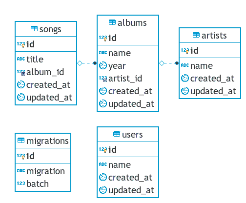

# Manten Music (Prueba Técnica)

El sitio contiene tres páginas.

1. **Página principal** ("/")

    La página principal consiste de una pantalla que pide el nombre del usuario que ingresó a la aplicación, seguida de un botón de "Entrar".

2. **Home** ("/home")

    Muestra el mensaje "Bienvenido, ", junto al nombre del usuario, seguido de un botón de "Mis Canciones Favoritas".

3. **Lista de álbumes** ("/list")

    Esta página contiene lo siguiente.
    - Listado de artistas registrados y total de álbumes del mismo.
    - Al seleccionar uno de los artistas, se muestra un listado de álbumes del mismo (nombre y año).
    - Al seleccionar uno de los álbumes, se muestra un listado de las canciones de dicho álbum.
    - Finalmente, al seleccionar una canción, bajo el mensaje de bienvenida al usuario en **Home**, se deberá mostrar el mensaje "Escuchando..." junto al nombre de la canción seleccionada.

4. **No autorizado** ("/unthorized")

    - Esta página se muestra cuando el usuario ha intentado ingresas a alguna página protegida como **Home** o **Lista de álbumes** sin primero haber intresado el nombre de usuario en la **Página principal**.

## Tecnologías usadas

### Frontend

- React (mediante Next.js).
  - El sitio contiene dos Context (API): uno para el usuario y otro para los artistas, álbumes y canciones seleccionadas.
- PropTypes.
- Styled-components.
- Algo de React-bootstrap.
- Formik, para manejo de formularios.
- Eslint (Airbnb) + Prettier
- Precommit, asegura que no se realizan *commits* que contengan errores en el *linter*.

### Backend

- PHP (Laravel 5.7)
- El paquete **barryvdh/laravel-cors**.
- MySQL.

    Relaciones en la DB.

    
